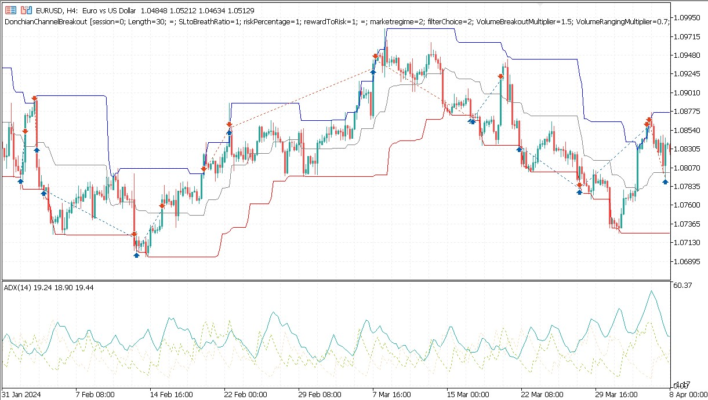
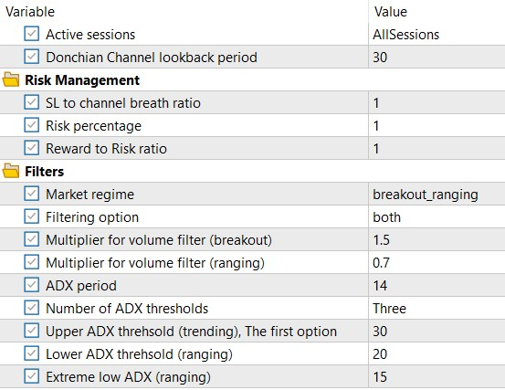
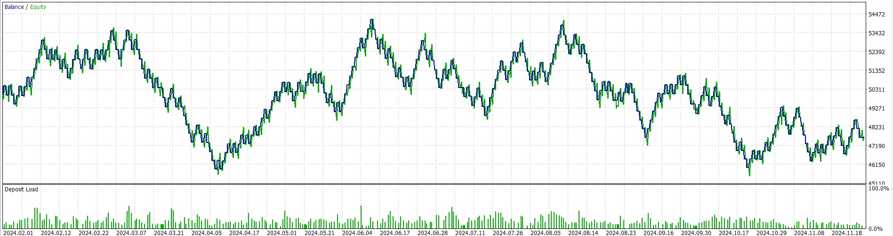

# Adaptive Channel Strategy

This simple trading strategy is based on the idea that when the price breaks out of a channel, two things can happen
1. The price will continue to move in the direction of the breakout in a trending regime
2. The price will revert back to the mean in a mean-reverting (ranging) regime

Donchian channel in particular is used in this strategy but it can be replaced with any other channel indicator like Keltner channel, Bollinger bands etc.

The strategy is adaptive in the sense that it tries to identify the regime and trade accordingly. For regime identification it uses many different filters:
1. Market session filter: For some assets there are certain sessions that the market typically is in a trending or ranging regime. For instance, EURUSD pair in the Asian session is typically in a ranging regime.
2. Volume filter: When the channel breakout is accompanied by high volume, it is more likely to be a trending regime. On the other hand, if the breakout is accompanied by low volume, it is more likely to be a ranging (mean-reverting) regime.
3. ADX filter: ADX is a good indicator of trend strength. If the ADX is above a certain threshold, it is more likely to be a trending regime. This strategy can use different number of thresholds (up to three) to be more flexible. 

# Risk Management
The strategy uses an adaptive stop loss and take profit. The stop loss could be based on two things:
1. ATR: The stop loss is set at a multiple of the ATR from the entry price. The multiple is adaptive and can be set to a fixed value or a multiple of the ATR.
2. Channel width: The stop loss is set at the other side of the channel. This is useful when the channel width is used as a measure of volatility.

# Inputs
All the inputs are shown in the table below:

# Backtesting Results
The strategy is very simple and should not be expected to be profitable on its own. However, it can be used as a part of a more complex strategy. A simple backtesting equity curve is shown below.

